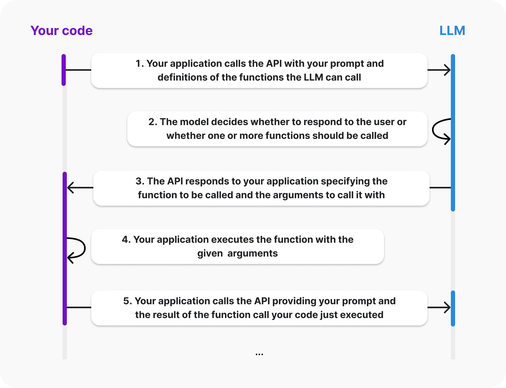

# LLM Tool Calls

Repository for experimenting with tool calls in LLMs (so far, GPTs hosted in Azure).
This demo does not use the deprecated `function_calls` but instead uses the newer `tool_calls`.

This demo supports completions on your own Azure OpenAI model deployment wth authentication using AD token authorization.
This demo can also generate chat completions via REST APIs with a subscription key (although this demo currently assumes you have access to the restricted completion API of NS).

The function that requests current train disruptions in the Netherlands requires access to the NS App API.
If you make an account on the [NS API Portal](https://apiportal.ns.nl/) you can gain free access to this API as an external party, because NS is legally obliged to share all available travel information with the public.



## Environment variables

Set the following variables in `.env`:

```
AZURE_OPENAI_ENDPOINT=
API_VERSION=
NS_APP_KEY=  # API key for the NS App to retrieve disruption data
NS_APIM_KEY=  # API key for the ChatNS API returning completions
DEPLOYMENT_NAME=  # Name of the model deployment generating completions
```

Note that only more recent completion APIs have access to tool calling.

## Conversation about the weather

This uses a dummy `get_current_weather` function that does not actually call an API but always says it's 20 degrees.
The main point here is that LLM knows how to fill the `location` and `format` parameters from the user query and use these in the function call:

```
System: Don't make assumptions about what values to plug into functions.
    Ask for clarification if a user request is ambiguous.

User: What's the weather like today in Nijmegen, Netherlands?

Function `get_current_weather` returns: It's 20 degrees celsius in Nijmegen, Netherlands

Assistant: The current temperature in Nijmegen, Netherlands is 20 degrees Celsius.
    If you need more detailed weather information, feel free to ask!
```

The query does not specify whether to give the temperature in Celsius or Fahrenheit.
This is inferred from the location!
The description of the `format` parameter explicitly mentions that it should be inferred from the context.

Let's check if Fahrenheit is used when we ask about a city in the United States instead.
I changed the default answer to 60 degrees because this range is more plausible for Fahrenheit but very implausible for Celcius.
Too bad: the assistant still answers in Celcius, but amusingly does note that this is exceptionally hot:

```
System: Don't make assumptions about what values to plug into functions.
    Ask for clarification if a user request is ambiguous.

User: What's the weather like today in New York, United States?

Function `get_current_weather` returns: It's 60 degrees celsius in New York, United States

Assistant: It seems there might be a misunderstanding.
    The temperature you provided, 60 degrees Celsius, seems unusually high for the current weather in New York.
    Could you confirm if that is the correct temperature measurement?
```

The parameter description in the tool call is `"enum": ["celsius", "fahrenheit"]`.
If I switch the order around, the model instead starts using `Fahrenheit` in the answer.
It seems that if the model fails to infer the correct temperature format, it uses the first enum value by default.

These experiments were done using `gpt-3.5-turbo-1106`.
TODO: The newer models are reported to be better at filling in tool parameters, so we should redo this experiment and see if the result differ.

## Queries without relevant function calls

When the user makes a query that is not related to any of the available tools, it should not call any tools.
In this particular instance, I did pass the available tools to let the LLM decide for itself whether to use the tool.

```
System: Don't make assumptions about what values to plug into functions.
    Ask for clarification if a user request is ambiguous.

User: Tell me something interesting

Assistant: Sure! Did you know that the city of San Francisco is known for its foggy weather?
    This fog is a result of the cool air from the Pacific Ocean meeting the warm air from inland areas,
    creating the iconic fog that often blankets the city. If you'd like, I can also provide you with the current weather in San Francisco. Just let me know!
```

Observations:

- Even though the LLM did not make a tool call (rightly so), the description of the weather function (which is about San Francisco) clearly biased the answer!
- It's also quite interesting that the assistant offers to look up the weather and makes known that it has the capability to do so.

Let's repeat the same query without passing any tools.
This gives a random interesting fact, like expected:

```
System: Don't make assumptions about what values to plug into functions.
    Ask for clarification if a user request is ambiguous.

User: Tell me something interesting

Assistant: Did you know that honey never spoils? Archaeologists have found pots of honey
    in ancient Egyptian tombs that are over 3,000 years old and still perfectly edible.
    The long shelf life of honey is due to its low moisture content and acidic pH,
    which create an inhospitable environment for bacteria and microorganisms.
```

## Train Disruptions API

Add `NS_APP_KEY` to `.env`.

The second tool queries an NS Disruptions API (you can make an account [here](https://apiportal.ns.nl/)) for current disruptions in train operations.

The following conversation was run on 22-03-2024 around 8:30 PM (in Dutch):

```
System: Don't make assumptions about what values to plug into functions. Ask for clarification if a user request is ambiguous.

User: Zijn er momenteel treinstoringen?

Function `get_all_train_disruptions` returns: Groningen - Leer. werkzaamheden
    Amsterdam - Rotterdam - Breda. beperkingen materieel

Assistant: Er zijn momenteel twee treinstoringen:

1. Tussen Groningen en Leer zijn er werkzaamheden.
2. Op de route Amsterdam - Rotterdam - Breda zijn er beperkingen vanwege materieel.

Laat me weten als je nog meer informatie nodig hebt!
```

For reference, this was the overview of disruptions on ns.nl at the same time:


This works great, but this API call does not require any parameters.
Let's try to do something a bit more specific.

A third tool calls a function to return any disruptions related to a specific train station.
The API call requires a station code.
Each train station has a [unique code](https://wiki.ovinnederland.nl/wiki/Lijst_van_verkortingen_van_treinstations).
For example, the code for Nijmegen is 'Nm' and the code for Amsterdam is 'Asd'.
These codes are public knowledge and do not change (but of course, over longer periods of time new stations may be added or old stations taken out of service).

The challenge here is to see if the LLM knows how to translate a question about station "Nijmegen" into an API call with code "Nm".
In the tool description, I described the parameter `station_code` as follows: "The official station code abbrevation, e.g. 'Nm' for station Nijmegen and 'Asd' for Amsterdam.".

For reference, at the moment of this experiment this is the situation:


First, I ask about disruptions about Amsterdam:

```
System: Don't make assumptions about what values to plug into functions. Ask for clarification if a user request is ambiguous.

User: Zijn er momenteel treinstoringen rondom station Amsterdam?

Function `get_disruptions_for_train_station` returns:
    Amsterdam - Rotterdam - Brussel. werkzaamheden
    Zwolle - Groningen. werkzaamheden
    Amsterdam - Schiphol. werkzaamheden
    Amsterdam - Rotterdam - Breda. beperkingen materieel

Assistant: Momenteel zijn er enkele treinstoringen rond station Amsterdam.
Er zijn werkzaamheden op de Amsterdam-Rotterdam-Brussel route, de Zwolle-Groningen route, en de Amsterdam-Schiphol route.
Daarnaast zijn er beperkingen in materieel op de Amsterdam-Rotterdam-Breda route.
```

Correct!
I don't understand why Zwolle and Groningen are returned by the API call, but this is not a problem with the LLM.

Now we ask about Nijmegen, where luckily the trains are driving on time (I'm taking the train here in 30 min).

```
System: Don't make assumptions about what values to plug into functions. Ask for clarification if a user request is ambiguous.

User: Zijn er momenteel treinstoringen rondom station Nijmegen?

Function `get_disruptions_for_train_station` returns: Er zijn geen verstoringen bekend voor station Nm.

Assistant: Op dit moment zijn er geen treinstoringen rondom station Nijmegen bekend.
```

In both cases the answers were awesome!
In the question about Nijmegen, we also clearly see in the function response that the LLM correctly translated "Nijmegen" to "Nm".

Of course, 'Nm' and 'Asd' were the two examples I provided in the parameter description.
Let's see if the LLM understand a question about Rotterdam ('Rtd').

```
System: Don't make assumptions about what values to plug into functions. Ask for clarification if a user request is ambiguous.

User: Zijn er momenteel treinstoringen rondom station Rotterdam?

Function `get_disruptions_for_train_station` returns:
    Amsterdam - Rotterdam - Brussel. werkzaamheden
    Amsterdam - Schiphol. werkzaamheden
    Den Haag - Rotterdam - Dordrecht. werkzaamheden
    Amsterdam - Rotterdam - Breda. beperkingen materieel

Assistant: Ja, er zijn momenteel treinstoringen rondom station Rotterdam vanwege werkzaamheden en beperkingen van materieel op verschillende trajecten.
```

Still seems to work great!
I'm quite impressed by these results, because typically quite a bit of effort goes into normalizing station names to station codes.
The LLM handles this natively.
